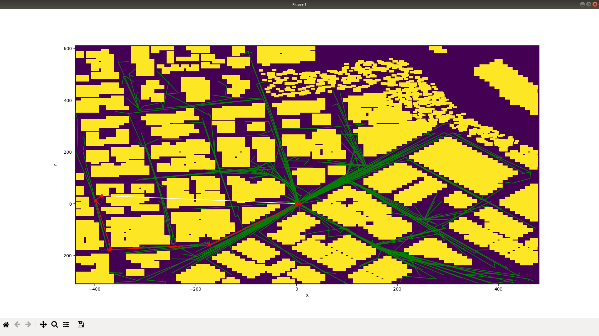
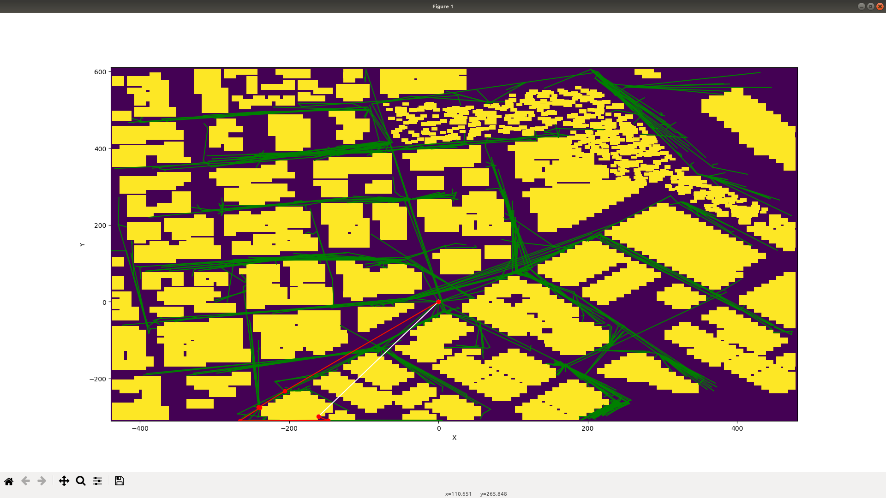

## Project: 3D Motion Planning

---

# Required Steps for a Passing Submission:
1. Load the 2.5D map in the colliders.csv file describing the environment.
2. Discretize the environment into a grid or graph representation.
3. Define the start and goal locations.
4. Perform a search using A* or other search algorithm.
5. Use a collinearity test or ray tracing method (like Bresenham) to remove unnecessary waypoints.
6. Return waypoints in local ECEF coordinates (format for `self.all_waypoints` is [N, E, altitude, heading], where the drone’s start location corresponds to [0, 0, 0, 0].
7. Write it up.
8. Congratulations!  Your Done!

## [Rubric](https://review.udacity.com/#!/rubrics/1534/view) Points
### Here I will consider the rubric points individually and describe how I addressed each point in my implementation.  

---
### Writeup / README

#### 1. Provide a Writeup / README that includes all the rubric points and how you addressed each one.  You can submit your writeup as markdown or pdf.  

Below I describe how I addressed each rubric point and where in my code each point is handled.

### Explain the Starter Code

#### 1. Explain the functionality of what's provided in `motion_planning.py` and `planning_utils.py`

The code in motion_planning.py implements the A* algorithm with 2D L2-norm heuristics:

function plan_path() does the following things:

1. read the 2.5D terrain map in colliders.csv and convert it into a 2D occupancy map by using its contour
 at 3m.

2. translate the 2D map such that its origin resides at the southwest corner, convert it into a grid with no coordinate
 information to save space.

3. invoke A* algorithm on the grid, get the path on the grid without collision

4. translate the path back into the original cartesian coordinate system

5. upload the path into the drone's waypoint cache, conclude the PLANNING stage and proceed to the next stage.

function a_star() does the following thing:

1. initialize a priority queue representing the visited nodes of the grid/graph

2. initialize a dictionary representing the inverted links between nodes.

3. iteratively apply the algorithm, find the adjacent feasible nodes of all the visited nodes that has the lowest
estimated cost, visit all of them and estimate their cost using the heuristic.

4. when the iteration hits the goal, terminate and snapshot the dictionary

5. starting from the goal, use the dictionary to trace back to the source.

6. revert the trace and output the solution.

### Implementing Your Path Planning Algorithm

#### 1. Set your global home position

read the first line, split by space, take the second and forth value and convert them into double type.

#### 2. Set your current local position

retrieve both home and current global position of the drone in geodetic coordinates, convert the current global position into NED (north-east-down) format

#### 3. Set grid start position from local position

grid start position is 2D local start position + offset

#### 4. Set grid goal position from geodetic coords

use the same global-to-local conversion function on the random goal geodetic coordinate w.r.t. home geodetic coordinate (since I cannot find the range of the geodetic coordinate anywhere, I generate a random local coordinate on the map). If the local coordinate is in the building, move it to the closest open space.

#### 5. Modify A* to include diagonal motion (or replace A* altogether)

The source code gives implementations of 2 algorithms for 2D planning: RRT* (in motion_planning_RRTstar.py) and the almost state-of-the-art P-RRT* (in motion_planning_P_RRTstar.py), an RRT* variant with a potential field guided sampling bias, it is described in [this article](https://arxiv.org/pdf/1704.00264).

Hyperparemeters:

- safetyDistance = 3m
- targetAltitude = 5m
- gamma/nearest point balls scale = 200m
- lambdaAttraction/attraction force coefficient in sampling bias = 0.5
- lambdaRepulsion/repulsion force coefficient in sampling bias = 0.5

The following 2 plots gives an example of generated path/graph:

- RRT*:

- P-RRT*

#### 6. Cull waypoints

Both algorithms asymptotically converge to shortest path, so theoretically this is not required.

However in test runs I observed unnecessary waypoints being inserted that increase the total length, is it necessary to add a path pruning/smoothing step after RRT* is finished?

### Execute the flight

#### 1. Does it work?
It works!
